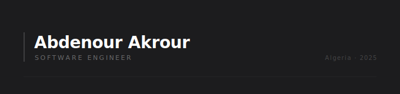

  

---

about

### Abdenour Akrour

Passionate about problem solving, OOP, and game development. 
I build scalable solutions across web, mobile and software systems — 
with a focus on performance, structure, and visual quality.

---

**LANGUAGES**

`C` &nbsp; `C++` &nbsp; `C#` &nbsp; `Java` &nbsp; `JavaScript` &nbsp; `Python`

**TOOLS & FRAMEWORKS**

`.NET` &nbsp; `React` &nbsp; `Next.js` &nbsp; `Node.js` &nbsp; `Qt` &nbsp; `MySQL` &nbsp; `Unity` &nbsp; `Unreal Engine`

**DESIGN & 3D**

`Blender` &nbsp; `Figma` &nbsp; `Krita` &nbsp; `Aseprite`

---

**GITHUB STATS**

---

**CONNECT**

[linkedin →](https://www.linkedin.com/in/akrour-abdenour-08a10235b/) &nbsp;&nbsp; [instagram →](https://instagram.com/12dou__)
